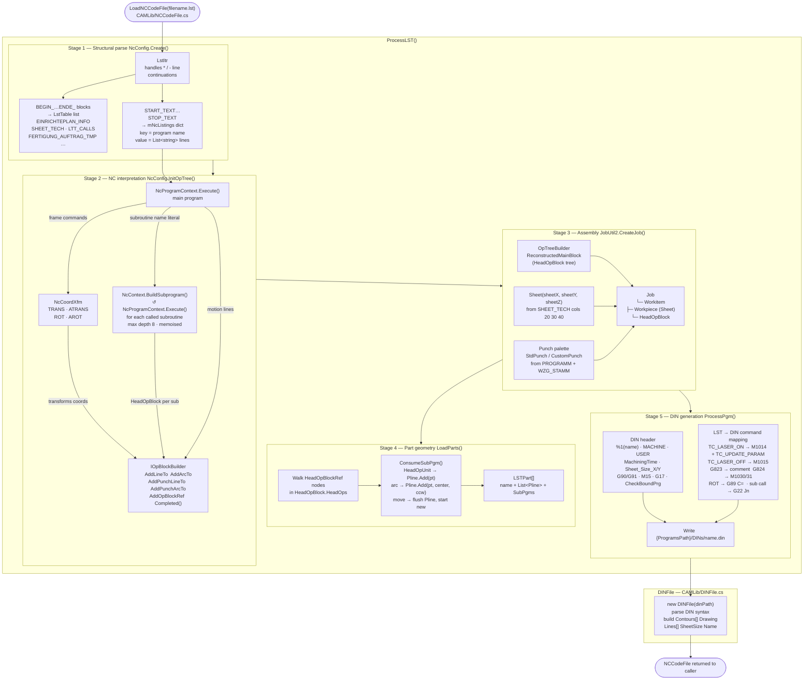
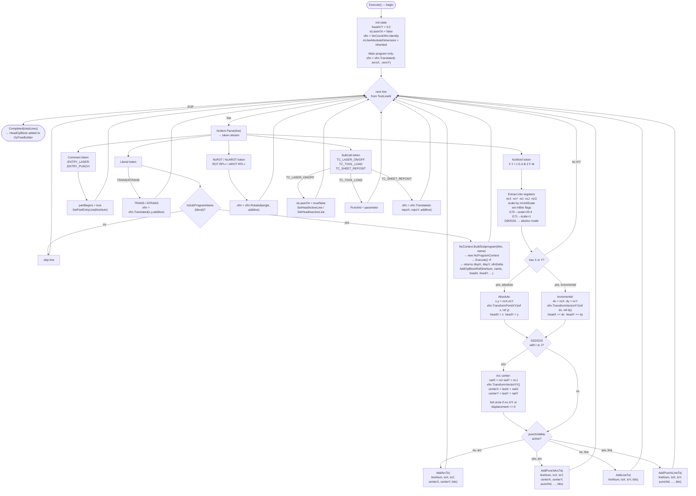
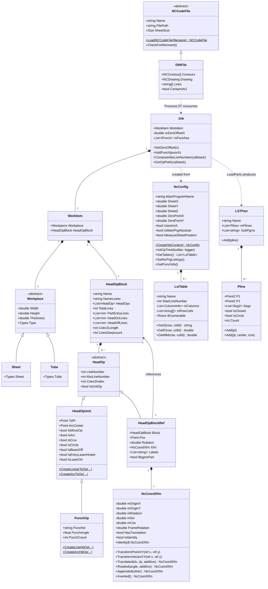
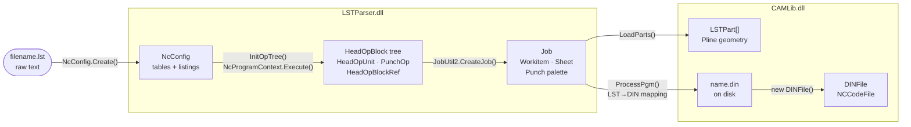

# LST Loading — Diagrams

Three diagrams: the overall pipeline, the NC interpreter inner loop, and the resulting object graph.

---

## 1 · Pipeline

---

## 2 · NcProgramContext.Execute() — per-line interpreter

---

## 3 · Result object graph

---

## 4 · Data flow summary

